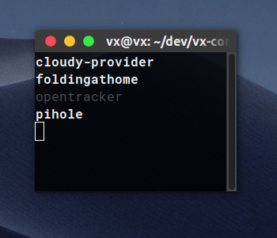

# compose-simple-terminal-monitor



Simple python script to display a visual report on docker-compose containers status in the terminal, refreshes every 15 seconds. Shows stopped containers in gray and unhealthy containers in red.

Hopefully it is useful to someone.


## Requirements

* docker-compose
* Python 3
* I've only tested this in ubuntu, hopefully it works elsewhere.

## Usage

```
cd your-folder-with-docker-compose
python3 /pathto/dockercomposemon.py
```

Will hopefully continue updating the status of the containers until you hit ctrl+C.


## Note

I am just sharing the script. I don't intend this to become a real command or app. But I guess nothing stops you from forking it into it (aside of the GPLv3's terms)